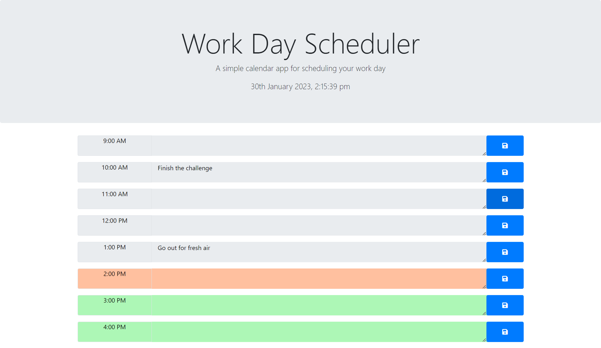

# mm-daily-scheduler

## Project description
Create a simple calendar application that allows a user to save events for each hour of the day by modifying starter code. This app will run in the browser and feature dynamically updated HTML and CSS powered by jQuery.

## Instructions
The app should:
- Display the current day at the top of the calender when a user opens the planner.
- Present timeblocks for standard business hours when the user scrolls down.
- Color-code each timeblock based on past, present, and future when the timeblock is viewed.
- Allow a user to enter an event when they click a timeblock
- Save the event in local storage when the save button is clicked in that timeblock.
- Persist events between refreshes of a page.

## Usage
To view the final results, you will need to open the page in the browser [Deployed Landing page](https://maudmain.github.io/mm-daily-scheduler/).
The page was built using minimal HTML and CSS and dynamically adding the elements, methods... using Jquery.
The date and time elements have been created using moment.js library.

The landing page displays the work daily scheduler for the hours between 9am and 5pm. 

The page is then divided into timeblocks for which you can input a text and save for each timeblocks. The information is stored locally and retrieved between sessions for the day.
You can replace the text input and save the information by clicking the save button on the timeblock selected.

## Credits
- edX Bootcamp: for project brief and criterias, tutorial and ressources about Jquery provided during this week's course.

What I have learned/ Resources:
- [moment.js](https://momentjs.com/)
    - [now](https://momentjs.com/docs/#/parsing/now/)
    - [format](https://momentjs.com/docs/#/displaying/format/)
    - [startOf](https://momentjs.com/docs/#/manipulating/start-of/)
    - [isAfter,isBetween](https://momentjs.com/docs/#/query/)
- [findLast()](https://developer.mozilla.org/en-US/docs/Web/JavaScript/Reference/Global_Objects/Array/findLast)
- [.siblings()](https://api.jquery.com/siblings/#siblings-selector)
- [.parent()](https://api.jquery.com/parent/#parent-selector)

## License
MIT